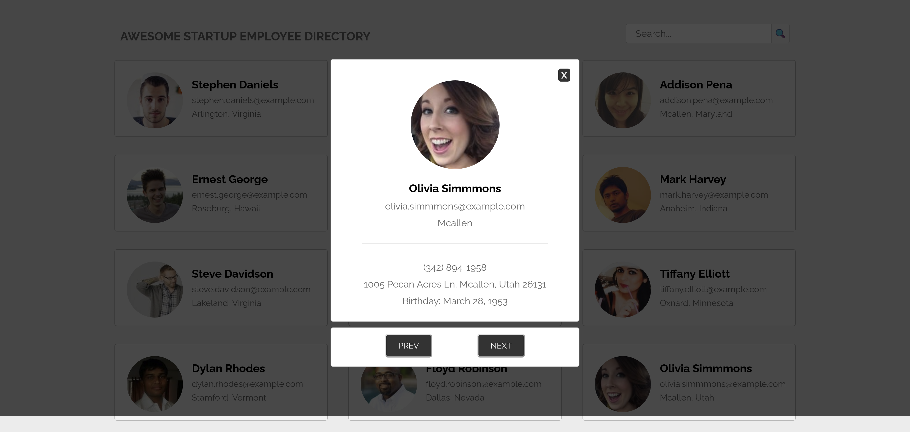

# 🙍‍♂️ Employee Gallery 🙍‍♀️

## Overview

The Employee Gallery is a dynamic web application that fetches random employee data from the [Random User Generator](https://randomuser.me/) API. Users can view employee profiles, search for employees by name, and view detailed information in a modal popup. The app is built using HTML, CSS, and JavaScript. This was my 5th project in the [Treehouse](https://teamtreehouse.com/) full stack JavaScript techdegree program. Fetching data from a public API was the main topic learned for this project.

## 🚀 Features

✅ **Dynamic Employee Cards**: Displays 12 random employee profiles fetched from an external API

✅ **Search Functionality**: Users can filter employees by name using a search bar

✅ **Modal Popup**: Clicking on an employee card opens a modal displaying detailed information, including name, email, location, and birthday

✅ **Next/Previous Navigation**: Users can cycle through employee profiles within the modal

## 🖥️ Live Demo

You can see this project in action [here](https://hermanconnor.github.io/employee-gallery/)

## ⌨️🖱️ Technologies Used

- HTML
- CSS
- JavaScript

## 🛠️ Getting Started

### Installation

1. Clone the repository or download the ZIP file.
2. Open `index.html` in your web browser.

## 📌 Usage

- Upon loading the page, the app fetches and displays 12 random employee profiles.
- Use the search bar to filter employees by name.
- Click on any employee card to view more details in a modal.
- Use the "Next" and "Prev" buttons in the modal to navigate through the employee profiles.

## Example

Here is a preview of the app:

## Acknowledgments

- Thanks to the [Treehouse](https://teamtreehouse.com/) coding community for providing invaluable resources and support.
